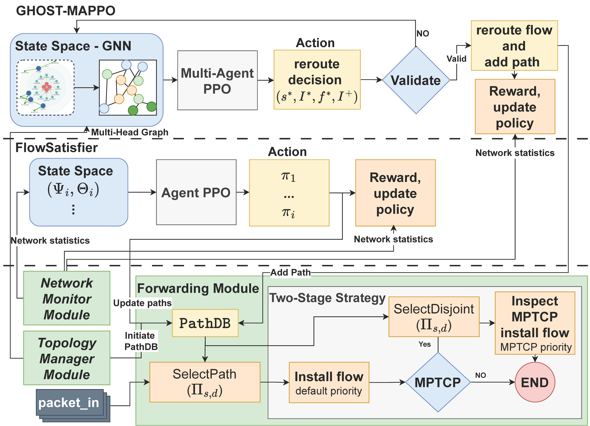

# MPTCP-Aware SDN Controller with Reinforcement Learning

This repository contains an MPTCP-aware Software-Defined Networking (SDN) controller built with Ryu framework, enhanced with reinforcement learning agents for intelligent traffic management and path selection optimization.

## System Overview



The system implements a hierarchical approach to MPTCP traffic management using two specialized reinforcement learning agents:

- **FlowSatisfier (RL Agent 1)**: PPO-based agent for MPTCP path selection
- **GHOST-MAPPO (RL Agent 2)**: Hierarchical GNN-based multi-agent PPO for advanced traffic engineering


## Running the System

### 1. Start the Ryu Controller

Before you run the controller and test script, make sure you have installed the required packages. 

```bash
# Navigate to the project directory
cd /path/to/Ryu_MPTCP-aware_

# Start the controller with default configuration
./run_ryuv.sh
```

The script will:
- Create necessary log directories
- Start the Ryu controller with all required modules
- Log output to `data/controller_log/log-TIMESTAMP.txt`

### 2. Launch Mininet Topology

In a separate terminal or mininet VM, copy all the files in mininet folder. Run mininet emulator:

```bash
# Run the 3-layer topology (Option 1: Run manual tests)
sudo python3 BigTopo.py

# Or use the automated script (Option 2: Runs automated test (~27 hours))
./run_test.sh
```
## System Requirements

### Operating System
- **Ubuntu 20.04.6 LTS** (tested and verified)
- **Ryu SDN Framework**: Version 4.34
- **Python**: 3.8.10

### Hardware Requirements
- **GPU**: CUDA-compatible GPU recommended for RL agents (automatic CPU fallback available)
- **RAM**: Minimum 8GB, recommended 16GB for large network topologies
- **Storage**: At least 2GB free space for logs and models

## Installation

### 1. Install System Dependencies

```bash
# Update system packages
sudo apt update && sudo apt upgrade -y

# Install Python and pip
sudo apt install python3 python3-pip python3-dev -y

# Install additional system dependencies
sudo apt install build-essential git wget curl -y
```

### 2. Install Python Requirements

```bash
# Install Python packages from requirements.txt
pip3 install -r requirements.txt

# Alternative: Install with specific CUDA version if needed
pip3 install torch==2.4.1 --index-url https://download.pytorch.org/whl/cu121
```

### 3. Verify Installation

```bash
# Check Python version
python3 --version

# Check Ryu installation
ryu --version

# Check CUDA availability (optional)
python3 -c "import torch; print(f'CUDA available: {torch.cuda.is_available()}')"
```

## Mininet Setup for MPTCP Support

### Prerequisites

The mininet experiments require a Mininet-compatible operating system with MPTCP kernel support. This typically requires:

1. **Ubuntu with MPTCP kernel** or dedicated **Mininet VM**
2. **MPTCP kernel modules** enabled

### Mininet Installation

```bash
# Verify MPTCP support
sysctl net.mptcp.enabled
```

### Available Mininet Topologies

The `mininet/` folder contains:

| File | Description |
|------|-------------|
| `BigTopo.py` | 3-layer network topology with 18 switches and 12 hosts |
| `test.py` | Traffic pattern testing script |
| `test_pattern.json` | Predefined traffic patterns configuration |
| `run_test.sh` | Automated topology execution script |

## Configuration

### Main Controller Settings (`setting.py`)

| Parameter | Default | Description |
|-----------|---------|-------------|
| `USE_AGENT1` | `True` | Enable FlowSatisfier (PPO) agent |
| `USE_AGENT2` | `True` | Enable GHOST-MAPPO agent |
| `USE_BASELINE` | `False` | Use random baseline instead of RL agents |
| `USE_BASELINE2` | `False` | Use SPF baseline instead of RL agents |
| `USE_BASELINE3` | `False` | Controller assigns all traffic to one path instead of RL agents |
| `k` | `4` | Number of paths computed with Yen's algorithm |
| `DEFAULT_FLOW_DEMAND` | `15` | Default flow demand (Mbps) |

## Reinforcement Learning Agents

### FlowSatisfier (RL Agent 1) - PPO Configuration

**Purpose**: MPTCP path selection optimization using Proximal Policy Optimization

**Location**: RL folder

**Configuration File**: `RL/config.py`

**Current Configuration**: Uses **medium** network size by default

#### Key Parameters

| Parameter | Small | Medium | Large | Description |
|-----------|-------|--------|-------|-------------|
| `state_dim` | 4 | 4 | 4 | State dimensions (flow_demand, ALU, MLU, delay_rank) |
| `action_dim` | 10 | 10 | 10 | Default action space size (dynamic based on number of paths) |
| `hidden_dim` | 32 | 64 | 128 | Neural network hidden layer size |
| `learning_rate` | 3e-4 | 1e-4 | 5e-5 | PPO learning rate |
| `batch_size` | 32 | 64 | 128 | Training batch size |
| `buffer_size` | 5000 | 10000 | 10000 | Experience replay buffer size |
| `gamma` | 0.99 | 0.99 | 0.99 | Discount factor |
| `clip_epsilon` | 0.2 | 0.2 | 0.2 | PPO clipping parameter |

#### Training Parameters

| Parameter | Value | Description |
|-----------|-------|-------------|
| `gae_lambda` | 0.95 | Generalized Advantage Estimation lambda |
| `entropy_coef` | 0.01 | Entropy regularization coefficient |
| `value_loss_coef` | 0.5 | Value function loss coefficient |
| `max_grad_norm` | 0.5 | Gradient clipping threshold |
| `update_epochs` | 6 | PPO update epochs per batch |

### GHOST-MAPPO (RL Agent 2) - Hierarchical GNN-PPO Configuration

**Purpose**: Hierarchical multi-agent reinforcement learning for advanced traffic engineering using Graph Neural Networks

**Location**: RL2 folder

**Configuration File**: `RL2/config.py`

**Current Configuration**: Uses **small** network size (configurable in `setting.py` as `AGENT2_NETWORK_SIZE`)

#### GNN Architecture Parameters

| Parameter | Small | Medium | Large | Description |
|-----------|-------|--------|-------|-------------|
| `gnn_type` | `"graphsage"` | `"graphsage"` | `"graphsage"` | GNN architecture type |
| `gnn_layers` | 3 | 3 | 3 | Number of GNN layers |
| `gnn_hidden_dim` | 128 | 96 | 128 | GNN hidden dimension |
| `gnn_output_dim` | 64 | 48 | 64 | GNN output dimension |
| `gnn_dropout` | 0.15 | 0.15 | 0.15 | Dropout rate for regularization |

#### Hierarchical Features

| Level | Features | Dimension | Description |
|-------|----------|-----------|-------------|
| Switch | MLU, flow_count | 2 | Switch-level network metrics |
| Port | utilization, flow_count | 2 | Port-level traffic statistics |
| Flow | rate, dst_dpid | 2 | Individual flow characteristics |
| New Port | utilization | 1 | New port selection features |

#### Training Configuration

| Parameter | Value | Description |
|-----------|-------|-------------|
| `update_interval` | 30 | Training update interval (seconds) |
| `save_interval` | 300 | Model checkpoint interval (seconds) |
| `memory_size` | 10000 | Experience replay memory size |
| `batch_size` | 32-64 | Training batch size (network-dependent) |
| `reward_type` | `"normalized"` | Reward calculation method |

#### Multi-Level Learning Rates

| Level | Learning Rate | Update Frequency | Min Memory |
|-------|---------------|------------------|------------|
| Switch | 3e-4 | Every 4 steps | 100 |
| Port | 3e-4 | Every 4 steps | 100 |
| Flow | 1e-4 | Every 6 steps | 100 |
| New Port | 3e-4 | Every 4 steps | 100 |


### 3. Monitor System Performance

The system provides multiple monitoring interfaces:

- **Web Interface**: Access real-time statistics and visualizations
- **REST API**: Query system state and metrics programmatically
- **Log Files**: Detailed execution logs in `data/` subdirectories

## Data Collection and Analysis

### Output Directories

| Directory | Content | Description |
|-----------|---------|-------------|
| `data/controller_log/` | System logs | Controller execution logs |
| `data/flow_rate_stats/` | Flow statistics | Traffic flow measurements |
| `data/path_selection/` | Path decisions | RL agent path selection logs |
| `data/topology_stats/` | Network metrics | Network topology and link statistics |
| `models/` | Trained models | Saved RL agent models |
| `plots/` | Visualizations | Generated performance plots |

### Experiment Data

- **Flow Rate Monitoring**: Real-time traffic measurements
- **Path Selection Logs**: RL agent decision history  
- **Network Utilization**: Link and switch utilization metrics
- **Performance Analytics**: Throughput, latency, and MLU statistics

## Model Management

### Agent Models

- **FlowSatisfier Models**: Stored in `models/agent1/`
- **GHOST-MAPPO Models**: Stored in `models/agent2/`

### Model Loading/Saving

Models are automatically saved based on configured intervals. To load existing models:

1. Set `AGENT1_NEW_MODEL = False` in `setting.py` for Agent 1
2. Set `AGENT2_NEW_MODEL = False` in `setting.py` for Agent 2
3. Specify model paths in `AGENT1_MODEL_NAME` and `AGENT2_MODEL_NAME`

## Troubleshooting

### Common Issues

1. **CUDA Not Available**: The system automatically falls back to CPU if CUDA is unavailable
2. **Permission Errors**: Ensure proper permissions for log directories and model storage
3. **Network Connectivity**: Verify Mininet and controller can communicate on default ports
4. **Memory Issues**: Reduce batch sizes in configuration for systems with limited RAM

### Performance Optimization

- **GPU Acceleration**: Ensure CUDA drivers are properly installed for optimal RL training
- **Network Size**: Adjust `AGENT2_NETWORK_SIZE` based on topology complexity


### Acknowledgments

Parts of this implementation are based on or adapted from existing research:

- **ARP Handler (`arp_handler.py`)** and **Network Delay Module (`network_delay.py`)**: Adapted from the DRL-M4MR framework by Ye et al.
  - **Paper**: "DRL-M4MR: An Intelligent Multicast Routing Approach Based on DQN Deep Reinforcement Learning in SDN"
  - **DOI**: https://arxiv.org/abs/2208.00383
  - **GitHub**: https://github.com/GuetYe/DRL-M4MR

- **Network Delay Module (`network_delay.py`)**: Adapted from the DRL-M4MR framework by Ye et al.
  - **Paper**: "Deep reinforcement learning based multicast routing method for SDN"
  - **Journal**: Future Generation Computer Systems, Volume 131, 2022, Pages 198-208
  - **DOI**: https://doi.org/10.1016/j.future.2022.01.009
  - **GitHub**: https://github.com/GuetYe/DRL-M4MR


## Contact

meshal.alruwisan@ucf.edu
